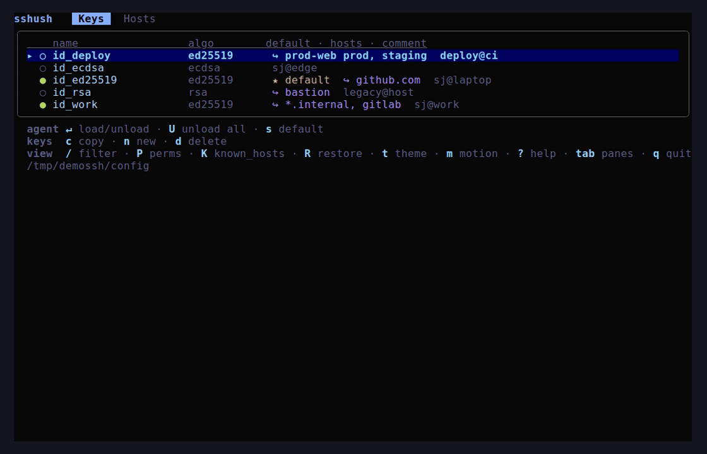

# sshush

[](https://github.com/s-johri/sshush/releases/latest)
[](https://github.com/s-johri/sshush/actions/workflows/ci.yml)
[](https://goreportcard.com/report/github.com/s-johri/sshush)
[](LICENSE)

**sshush** is an interactive terminal UI (TUI) for managing SSH keys, the
ssh-agent, and your `~/.ssh/config` — an SSH key manager, agent controller,
config editor, and connection launcher in one keyboard-driven app, written in
Go. Switch keys, see what's loaded in the agent, browse and connect to hosts,
and edit your config safely without leaving the terminal.

> Status: in active development. Edits to your SSH config are gated behind a
> confirmation and a `.bak` backup is written before the first change, but treat
> it as pre-1.0 software.

## Demo



<!-- Regenerate with: vhs docs/demo.tape  (see docs/demo.tape) -->

## Features

- **Keys pane** — every key pair in `~/.ssh`, its algorithm, fingerprint, agent
  load state (`●` loaded / `○` not), the default key (`★`), and which hosts use
  it (`↪ host, …`).
- **Agent integration** — load/unload a key (`ssh-add`), unload everything
  (`ssh-add -D`), and see agent-only keys that aren't on disk.
- **Hosts pane** — hosts from `~/.ssh/config` and its `Include`d files with their
  connection details (`user@hostname:port`), including wildcard (`Host *`) and
  read-only `Match` blocks.
- **Connect to a host** — press `Enter` on a host to `ssh` into it; your own
  config (`ProxyJump`, `IdentityFile`, …) applies, and the terminal is handed to
  the session. Under a custom config location (`config_path` / `SSHUSH_CONFIG` /
  `ssh_dir`), the connection runs `ssh -F <config> <alias>` so aliases resolve
  against the right file with full wildcard/`Match` fidelity.
- **Copy to clipboard** — `c` copies a key's public key or fingerprint, or a
  host's ready-to-run `ssh` command — an explicit invocation expanded from the
  host's own block (`-p` / `-i` / `-o` flags), shell-quoted for safe pasting
  (needs `xclip`/`wl-clipboard` on Linux).
- **Scroll & search** — panes scroll for long lists (`PgUp`/`PgDn`, `g`/`G`); `/`
  filters the active pane (keys by name/comment/algorithm, hosts by
  name/hostname/user).
- **Edit config in place** — change `HostName`/`User`/`Port`, add/edit/delete any
  directive (e.g. `ForwardAgent yes`), add or delete whole hosts (guided wizard),
  and attach/detach keys to a host (`IdentityFile`). Formatting and comments are
  preserved; a backup is written first.
- **Security checks** — audit and fix loose `~/.ssh`/key permissions (`P`), and
  browse or remove `known_hosts` entries (`K`).
- **Restore from backup** — `R` (or `sshush restore`) reverts the config to the
  `.bak` snapshot written before the session's first edit, so a bad change is one
  keystroke to undo.
- **Generate & delete keys** — `ssh-keygen` wrapper; the new-key wizard prompts
  for algorithm, size, file name, and a key comment (`-C`, defaulting to the file
  name). Deleting a key also removes it from the agent.
- **Default identity** — mark a key as default and have it auto-loaded into the
  agent on startup (in-app, or on every shell via `sshush shell-init`).
- **Themes & motion** — 16 built-in color themes (foreground + background) with a
  live in-app switcher (`t`), plus an opt-in motion/animation system (`m`).
- **Hot reload** — external changes to your config or `~/.ssh` are picked up
  automatically.

## Requirements

- Go 1.25+ (to build from source)
- `ssh-agent`, `ssh-add`, `ssh-keygen` on your `PATH`
- A running agent (`echo $SSH_AUTH_SOCK` should be non-empty) for agent features
- (Linux) `xclip`, `xsel`, or `wl-clipboard` for clipboard copy (`c`); macOS and
  Windows use the native pasteboard

## Install

### Homebrew (macOS / Linux)

```bash
brew install s-johri/tap/sshush
```

### Arch Linux (AUR)

```bash
yay -S sshush-bin   # or: paru -S sshush-bin
```

Both ship shell completions and the man page (`man sshush`).

### Install script

```bash
curl -fsSL https://raw.githubusercontent.com/s-johri/sshush/main/install.sh | sh
```

Detects your OS/arch, downloads the matching release archive, verifies its
checksum, and installs `sshush` to `~/.local/bin` (override with `INSTALL_DIR`).
Pin a version with `SSHUSH_VERSION=v0.7.0`.

### Prebuilt binary

Download the archive for your OS/arch from the
[latest release](https://github.com/s-johri/sshush/releases/latest), extract it,
and put `sshush` on your `PATH`. Once installed from a release, update in place:

```bash
sshush update    # fetches the latest release and replaces the binary
sshush version   # show the installed version
```

### Build from source

```bash
git clone https://github.com/s-johri/sshush.git
cd sshush
go build -o "$(go env GOPATH)/bin/sshush" ./cmd/sshush
```

Make sure `$(go env GOPATH)/bin` is on your `PATH`.

Run the tests with `go test ./...`. The end-to-end suite (a throwaway
`ssh-agent`, key, and config) is behind a build tag — `go test -tags e2e ./...`
— and needs `ssh-agent`/`ssh-add`/`ssh-keygen` on your `PATH`.

### go install

```bash
go install github.com/s-johri/sshush/cmd/sshush@latest
```

### Shell completions

The Homebrew and AUR packages install completions automatically. For a manual
install, run `sshush install-extras` to write the embedded man page and all three
completion scripts to your user directories (XDG paths); `sshush update` and
`install.sh` refresh them. Or print a single script yourself:

```bash
sshush install-extras   # man page + bash/zsh/fish completions → user dirs
sshush completion bash > /etc/bash_completion.d/sshush
sshush completion zsh  > "${fpath[1]}/_sshush"
sshush completion fish > ~/.config/fish/completions/sshush.fish
```

## Usage

```bash
sshush              # launch the interactive TUI
sshush load-default # load the configured default identity into the agent
sshush shell-init   # print a shell snippet to load the default on shell start
sshush restore      # revert the SSH config to the backup from before edits
sshush update       # update to the latest release
sshush version      # print the installed version
sshush completion <shell>  # print a bash/zsh/fish completion script
sshush install-extras      # install the man page + completions to user dirs
sshush help         # show help
```

### Keybindings

**Keys pane**

| Key | Action |
|-----|--------|
| `↵` enter / space | load / unload the selected key in the agent |
| `U` | unload all keys from the agent |
| `s` | toggle the selected key in/out of the startup defaults |
| `c` | copy the public key or fingerprint to the clipboard |
| `n` | generate a new key (`ssh-keygen`) |
| `d` | delete the selected key's files (irreversible) |

**Hosts pane**

| Key | Action |
|-----|--------|
| `↵` enter | `ssh` into the selected host |
| `e` | edit host directives (`tab` to cycle, `ctrl+o` add option, `ctrl+d` delete) |
| `i` | attach / detach keys for the host |
| `c` | copy a ready-to-run `ssh` command to the clipboard |
| `n` | add a new host (guided wizard) |
| `d` | delete the host |

Read-only `Match` blocks are shown for reference; edit/connect actions are
declined on them.

**Anywhere**

| Key | Action |
|-----|--------|
| `tab` / `←` `→` | switch panes |
| `↑` `↓` / `k` `j` | move |
| `PgUp` `PgDn`, `g` `G` | page / jump to top / bottom |
| `/` | filter the active pane (`esc` clears) |
| `P` / `K` | permission audit / known_hosts |
| `R` | restore config from backup (undo edits since session start) |
| `t` / `m` | switch theme / toggle motion |
| `?` | full keybinding help |
| `r` | refresh |
| `q` / `ctrl+c` | quit |

Writes are confirmed with `y` / `n`; `esc` cancels an overlay.

## Load the default key on shell startup

Mark a key as default in the TUI (Keys pane → `s`), then add the snippet to your
shell rc so each new shell loads it:

```bash
sshush shell-init >> ~/.bashrc   # or ~/.zshrc
```

The snippet only runs if `sshush` is on your `PATH`, and `load-default` is a
no-op when the keys are already loaded — cheap and safe to run on every shell.
`shell-init` warns (on stderr) if the snippet is already in a shell rc, so you
don't add it twice; the TUI also nudges you to install it when you set a default.

## Configuration

sshush stores its own settings (separate from `~/.ssh/config`) at
`$XDG_CONFIG_HOME/sshush/config.toml` (default `~/.config/sshush/config.toml`):

```toml
# Keys auto-loaded into the agent on startup (toggle with `s` in the TUI).
default_identities = ["id_ed25519", "id_work"]

# Optional: point sshush at a non-default SSH location.
# ssh_dir resolves relative Includes and ~ in the config; config_path defaults
# to <ssh_dir>/config when only ssh_dir is set.
ssh_dir = "~/.ssh"
config_path = "~/.ssh/config"

# Optional: color theme (sets foreground + background). Switch live in-app with
# `t`. Presets: default, mono, high-contrast, dracula, nord, gruvbox-dark,
# gruvbox-light, solarized-dark, solarized-light, catppuccin-mocha,
# catppuccin-macchiato, catppuccin-frappe, catppuccin-latte, tokyonight,
# tokyonight-storm, tokyonight-day.
theme = "default"

# Optional: check for a newer release on launch (default true). The check is
# async and best-effort; a notice appears in the status line if an update exists.
check_updates = true

# Optional: opt-in motion/animation (off by default). Toggle in-app with `m`.
[motion]
enabled = false
intensity = "normal"   # subtle | normal | arcade
```

`default_identities` is managed from the TUI (`s` toggles a key in/out; all are
loaded on startup). An older `default_identity = "..."` is migrated automatically.
The path overrides can also come from the environment (which takes precedence):

```bash
export SSHUSH_SSH_DIR=~/work/.ssh
export SSHUSH_CONFIG=~/work/.ssh/config
```

The keys above are the stable `config.toml` schema (frozen as of the v0.9.0
release candidate): within the 1.x line they are never removed or repurposed,
only added. Parsing is forward-compatible — an unknown key is ignored, with a
`sshush: unknown setting "…" (ignored)` warning on stderr at startup so typos and
stale keys stay visible.

## How it works

sshush merges three sources into one view on each refresh:

1. key pairs scanned from `~/.ssh`,
2. hosts parsed from `~/.ssh/config` (following `Include`s),
3. identities currently loaded in the agent,

matching disk keys to agent keys by SHA256 fingerprint. Config writes go through
a round-tripping parser so comments, ordering, and unknown options survive
edits. See [ARCHITECTURE.md](ARCHITECTURE.md) for the design.

## Looking for the YAML config generator?

There is an unrelated, similarly named project:
[bencromwell/sshush](https://github.com/bencromwell/sshush) generates a static
`ssh_config` file from YAML source files. This sshush is different — an
interactive TUI that works with your existing `~/.ssh/config` directly and also
manages keys, the ssh-agent, `known_hosts`, and permissions. If you arrived
here looking for the YAML tool, the link above is what you want.

## Changelog

See [CHANGELOG.md](CHANGELOG.md) for the per-release history.

## License

MIT — see [LICENSE](LICENSE).
